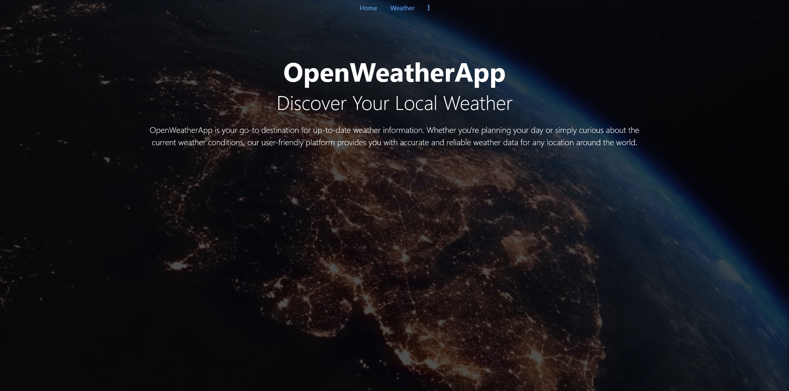

# OpenWeatherApp

## Descripción
OpenWeatherApp es una aplicación web que te permite conocer la información meteorológica actual y futura de cualquier ubicación en todo el mundo. La aplicación proporciona datos precisos y confiables sobre el clima, lo que te permite planificar tus actividades al aire libre o simplemente mantenerte informado sobre las condiciones climáticas actuales.

## Características

- Información meteorológica actualizada.
- Pronóstico del tiempo para los próximos días.
- Búsqueda de ubicaciones por nombre.
- Modo claro y oscuro para una experiencia de usuario personalizable.
- Geolocalización para obtener información meteorológica basada en tu ubicación actual.

## Uso

1. Ingresa el nombre de la ciudad o ubicación que desees consultar en el campo de búsqueda.
2. Haz clic en el botón de búsqueda para obtener la información meteorológica.
3. Explora los detalles, como la temperatura, humedad, velocidad del viento y pronóstico del tiempo.
4. Cambia entre el modo claro y oscuro según tus preferencias utilizando el botón correspondiente en el menú de navegación.

## Tecnologías Utilizadas

- HTML
- CSS (con Bootstrap 5.3)
- jQuery
- API de OpenWeatherMap

## Configuración

Para ejecutar la aplicación en tu entorno local, sigue estos pasos:

1. Clona este repositorio a tu máquina local: `git clone <URL_DEL_REPOSITORIO>`.
2. Abre el archivo `index.html` en tu navegador web.

## Créditos

- [OpenWeatherMap](https://openweathermap.org) para proporcionar los datos meteorológicos a través de su API.
- [Bootstrap](https://getbootstrap.com) para estilizar la interfaz de usuario.
- [Font Awesome](https://fontawesome.com) para los iconos utilizados en la aplicación.
- [jQuery](https://jquery.com/) Framework Javascript.

## Autor

Este proyecto fue creado por [Cristian Arana Castiñeiras](https://github.com/Cristiancastt).

## Licencia

Este proyecto está disponible bajo la Licencia MIT. Consulta el archivo [LICENSE](./LICENSE) para obtener más detalles.

---

¡Gracias por usar OpenWeatherApp! Esperamos que te sea útil para mantenerte informado sobre el clima.
